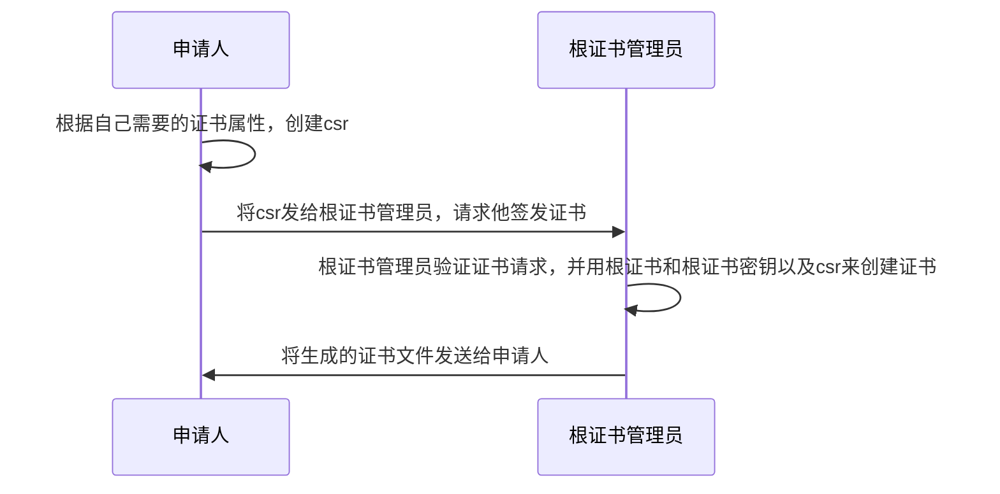

## 需求分析

当用户使用的不是企业证书解决方案，或者由于某种原因不想通过 CA 购买证书，如用于测试等场景，则需要创建自签名证书。
可以通过 Linux 的 OpenSSL 命令行工具生成自签名证书，实现加密解密， 甚至还可以当做 CA 来用，创建以及吊销证书。

保管根证书，所有其他证书都由这个根证书来签发。用户/同事只需要把这个根证书添加到受信任的根证书，然后所有其他由此根证书签发的证书都会被自动信任（前提是证书设置正确）。

## 根证书概念

根证书是CA给自己颁发的证书,是信任链的起始点。安装根证书意味着对这个CA认证中心的信任。

[百度百科上的解释]([https://baike.baidu.com/item/%E6%A0%B9%E8%AF%81%E4%B9%A6/9874620?fr=aladdin](https://baike.baidu.com/item/根证书/9874620?fr=aladdin))

## CSR概念

Certificate Signing Request的英文缩写，即证书请求文件，也就是证书申请者在申请数字证书时由CSP(加密服务提供者)在生成私钥的同时也生成证书请求文件，证书申请者只要把CSR文件提交给证书颁发机构后，证书颁发机构使用其根证书私钥签名就生成了证书公钥文件，也就是颁发给用户的证书。

## 证书生成流程



## 示例

### 首先创建一个CA根证书（根证书管理员来做）：

使用 OpenSSL 可以创建自己的 CA，给需要验证的用户或服务器颁发证书，在创建 CA 根证书之前，请做好如下准备工作：修改好 CA 的配置文件、序列号、索引等等。

1. 创建 CA 目录

   ```shell
    mkdir -p ~/ssl/demoCA/{certs,newcerts,crl,private}
    cd ~/ssl/demoCA
    touch index.txt
    echo "01" > serial
   ```

   具体每个目录存储什么信息，可以查看 `openssl` 的配置文件：`vi /etc/ssl/openssl.cnf`:

2. 修改 `openssl.cnf `文件

   不同版本虚拟机这个文件的位置不一样

   CentOS 7 在 `/etc/pki/tls/openssl.cnf`目录下

   建议拷贝 `openssl.cnf `文件到自定义文件夹下，这样可以自定义证书和证书申请中的一些属性和扩展，如秘钥扩展等：

   ```shell
    sudo cp /etc/ssl/openssl.cnf ~/ssl/openssl.cnf
    vi ~/ssl/openssl.cnf
    
    修改CA_default下面的dir
    [ CA_default ]
    dir             = /root/ssl/demoCA      # Where everything is kept
   ```

3. 生成 CA 根证书及密钥

   ```shell
   openssl req -new -x509 -newkey rsa:4096 -keyout cakey.key -out cacert.crt -config openssl.cnf -days 3650
   ```

   `-x509` 是代表使用 X.509 证书结构生成证书，X.509 证书的结构是用 ASN1(Abstract Syntax Notation One)进行描述数据结构。`-days 3650`代表证书有效期，按天来算这里是10年。

   这里还要输入密码，用来保护根证书。有密码的话每次使用的时候都要输入密码才能使用。不要密码的话可以使用`-nodes`参数。

   X.509 证书编码格式主要有两种： `.PEM` 和`.DER`。
   `.DER` 是二进制编码，可包含所有私钥、公钥和证书，是大多数浏览器的缺省格式，常见于 Windows 系统中的证书格式。
   `.PEM` 是明文格式的, 以 “`-----BEGIN CERTIFICATE-----` 开头，以 `-----END CERTIFICATE-----` 结尾”, 中间是经过 base64 编码的内容, Apache 和 NGINX 服务器偏向于使用这种编码格式，也是 openssl 默认采用的信息存放方式。**PEM 其实就是把 DER 的内容进行了一次 base64 编码**。

   此处通过命令生成扩展名为`.crt`的根证书文件和扩展名为`.key` 的公钥，生成的证书和公钥可能是`.PEM` 编码格式，也可能是`.DER` 编码格式。

   把根证书和公钥保存在`.cer`文件中， 再通过 FTP/SFTP 等方式传到本地 Windows 主机文件夹，点击安装根证书并添加到了 windows 的 current User\Trusted Root Certification Authority 目录下,这样由这个根证书签发的证书就会被自动信任。

   ```shell
   cat cacert.crt cakey.key > cacert.cer
   ```

4. Linux 查看证书信息，编码，转码：

   查看公钥的内容命令为：`openssl rsa -noout -text -in cakey.key`
   即可观察秘钥的编码方式，如果为`.PEM` ,则会以 base 64 明文方式显示。

   查看证书的内容命令为：`openssl x509 -noout -text -in cacert.crt`
   证书编码格式转换:

   - PEM 转为 DER：`openssl x509 -in cacert.crt -outform der -out cacert.der`
   - DER 转为 PEM：`openssl x509 -in cert.crt -inform der -outform pem -out cacert.pem`

### windows 导入根证书:

`cmd`命令行中输入 `certmgr`,找到受信任的根证书颁发机构-证书，右键 -所有任务-导入 然后找到`cacert.crt`并导入

### 使用CA证书签发其他证书：

1. 创建证书签名请求(证书申请者来做的)

   使用 OpenSSL 创建客户端证书时，请注意：

   - 创建私钥时，请将长度指定为 `4096`。

   1. 生成 4096 bit 的客户端私钥

      ```shell
       openssl genrsa -out client.key 4096
      ```

   2. 用该客户端私钥生成证书签名请求，扩展名`.csr`

      ```shell
       openssl req -new -key client.key -out client.csr -config openssl.cnf
      ```

      如果是申请给网站用的证书的话，需要再加个`extfile`：

      ```shell
      [root@CA ~]# vim http.ext
      keyUsage = nonRepudiation, digitalSignature, keyEncipherment
      extendedKeyUsage = serverAuth
      subjectAltName=@SubjectAlternativeName
      
      [ SubjectAlternativeName ]
      DNS.1=*.test.com
      IP.1=1.2.3.4
      ```

      `extendedKeyUsage` 可以指定证书目的，即用途，一般有：
      `serverAuth`：保证远程计算机的身份
      `clientAuth`：向远程计算机证明你的身份
      `codeSigning`：确保软件来自软件发布者，保护软件在发行后不被更改
      `emailProtection`：保护电子邮件消息
      `timeStamping`：允许用当前时间签名数据
      如果不指定，则默认为 所有应用程序策略

      `SubjectAlternativeName`内容：

      DNS.1用来确保网站的域名必须时*.test.com，

      IP.1用来确保网站的IP地址，如果证书里面的内容和实际对应不上，浏览器就会报错。

   3. 将`client.csr`和`http.ext`这两个文件交给根证书管理员

      

2. 根证书管理员签发证书

   ```shell
   openssl ca -in client.csr -out client.crt -cert cacert.crt -keyfile cakey.key -config openssl.cnf -days 3650 -extfile http.ext
   ```

   根证书管理员将签署好的证书`client.crt`发送给申请者。申请者使用`client.crt`以及一开始生成的`client.key`就能启用https服务了。

   

   默认情况下`openssl.cnf`的配置是：
   
   ```
   countryName             = match
   stateOrProvinceName     = match
organizationName        = match
   ```

   
   
   这三个设置的意义就是保证`csr`的`countryName,stateOrProvinceName,organizationName`,要和根证书一致，不过是可以修改的，只要将match改成`opetional`就行

## 证书有效性验证

可以利用`openssl` 的`s_server`命令来模拟一个服务端，要使用到证书管理员生成的证书`client.crt`，以及申请人在创建`csr`时生成的 `client.key`  

注意：证书如果有 指定ip，要在IP地址为这个地址的主机上运行。

`openssl s_server -cert client.crt -key client.key -debug -HTTP -accept 443` 

然后浏览器访问 `https://ip地址`来查看证书是否有效（要先导入根证书到信任的根证书颁发机构）。

## 参考文章

[如何用 OpenSSL 创建自签名证书](https://docs.azure.cn/zh-cn/articles/azure-operations-guide/application-gateway/aog-application-gateway-howto-create-self-signed-cert-via-openssl#setcion1)

[OpenSSL自签发自建CA签发SSL证书](https://www.cnblogs.com/will-space/p/11913744.html)

[写给小白，关于如何申请CSR（证书验证文件）?](https://www.zhihu.com/question/58144646)