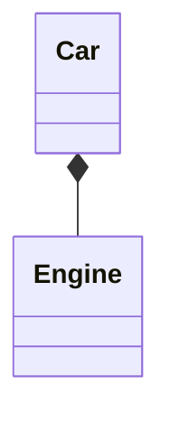

## Objects

### The Progress of Abstraction

`Assembly language` is a minimal abstraction of the underlying machine. Many so-called “imperative” languages (such as `FORTRAN`, `BASIC`, and `C`) were themselves abstractions of assembly language. Although they were big improvements, their primary abstraction still requires you to think in terms of the structure of the computer rather than the structure of the problem you are trying to solve.

`An Object has state, behavior and identity.`

These characteristics represent a pure approach to object-oriented programming: 

1. **Everything is an object.** Think of an object as a fancy variable; it stores data, but you can “make requests”, asking it to perform operations on itself. You can usually take any conceptual component in the problem you’re trying to solve (dogs, buildings, services, etc.) and represent it as an object in your program. 
2. **A program is a bunch of objects telling each other what to do by sending messages.** When you “send a message” to an object, it’s a request to call a method that belongs to that object. 
3. **Each object has its own memory made up of other objects.** Put another way, you create a new kind of object by packaging existing objects. This hides the complexity of a program behind the simplicity of objects.
4. **Every object has a type.** Each object is an instance of a class, where “class” is (approximately) synonymous with “type.” The most important distinguishing characteristic of a class is “What messages can you send to it?” 
5. **All objects of a particular type can receive the same messages.** This is a loaded statement, as you will see later. Because an object of type “circle” is also an object of type “shape,” a circle is guaranteed to accept shape messages. This means you can write code that talks to shapes and automatically handles anything that fits the description of a shape. This substitutability is a foundation of GOP. 

### An Object Has an Interface

So, although what we really do in object-oriented programming is create new data types, Virtually al object-oriented programming languages use the “`class`” keyword. When you see the word “`type`” think “`class`” and vice versa.

### Objects Provider Services

`High cohesion` is a fundamental quality of software design: It means the various aspects of a software component (such as an object, although this could also apply to a method or a library of objects) “fit together” well.

### The Hidden Implementation

Break up the playing field into class creators (those who create new data types) and client programmers (the class consumers who use the data types in their applications).

### Reusing the Implementation

The simplest way to reuse a class is to use an object of that class directly, but you can also place an object of that class inside a new class. Your new class can be made up of any number and type of other objects, in any combination, to produce the desired functionality. Because you `compose` a new class from existing classes, this concept is called **`composition`** (if composition is dynamic, it’s usually called **`aggregation`**). Composition is often called a `has-a relationship`, as in “A car has an engine.”



`Composition` comes with a great deal of flexibility. The member objects of your new class are typically private, making them inaccessible to client programmers who use the class. This means changing those members doesn’t disturb existing client code.

### Inheritance

### Is-a vs. Is-Like-a Relationship

### Interchangeable Objects with Polymorphism

The function call generated by a non-OOP compiler produces what is called `early binding`, a term you might not have heard because you’ve never thought about it any other way. It means the compiler generates a call to a specific function name, which resolves to the absolute address of the code to be executed. With inheritance, the program cannot determine the address of the code until run time, so some other scheme is necessary when a message is sent to an object.

To solve the problem, object-oriented languages use the concept of `late binding`. When you send a message to an object, the code called isn’t determined until run time. The compiler does ensure that the method exists and performs type checking on the arguments and return value, but it doesn’t know the exact code to execute.

We call this process of treating a derived type as though it were its base type `upcasting`.

### The Singly-Rooted Hierarchy

An OOP issue that has become especially prominent since the introduction of C++ is whether al classes should by default be inherited from a single base class. In Java (as with virtually all other OOP languages except for C++) the answer is yes, and the name of this ultimate base class is simply Object.

### Collections

### Parameterized Types (Generics)

Instead, you cast down the hierarchy to a more specific type, so this manner of casting is called `downcasting`. With `upcasting`, you know that a Circle is a type of Shape so it’s safe to `upcast`, but you don’t know that an Object is necessarily a Circle or a Shape so it’s not safe to `downcast` unless you determine extra type information about that object.

### Object Creation & Lifetime

### Exception Handling: Dealing with Errors

## Objects Everywhere

### You Manipulate Objects with References

Java simplifies the issue by considering everything an object, using a single consistent syntax. Although you treat everything as an object, the identifier you manipulate is actually a “`reference`” to an object.

### You Must Create All the Objects

The point of a reference is to connect it to an object. You usually create objects with the new operator. The keyword new says, “Make one of these.”

## Where Storage Lives

### Overloading on Return Values

Why not distinguish between methods based on their return values? For example, these two methods, which have the same name and arguments, are easily distinguished from each other:
```java 
void f() {}
int f() { return 1; }
```
This might work fine as long as the compiler could unequivocally determine the meaning from the context, as in
```java
 int x = f()
```
However, you can also call a method and ignore the return value. This is calling a method for its side effect, since you don’t care about the return value, but instead want the other effects of the method call. So if you call the method this way: 
```java
f();
```
how can Java determine which f() should be called?

### No-arg Constructors

When you don’t put in any constructors, it’s as if the compiler says, “You are bound to need some constructor, so let me make one for you.” But if you write a constructor, the compiler says, “You’ve written a constructor so you know what you’re doing; if you didn’t put in a default it’s because you meant to leave it out.”

### The `this` Keyword

The compiler does some undercover work so you can write code this way. There’s a `secret first` argument passed to the method, and that argument is `the reference to the object that’s being manipulated`.

### Calling Constructors form Constructors

the compiler won’t let you call a constructor from inside any method other than a constructor.

### The Meaning of `static`

### Clean up: Finalization and Garbage Collection

The garbage collector only knows how to release memory allocated with new, so it won’t know how to release the object s special” memory. To handle this case, Java provides a method called `finalize()` you can define for your class.
When the garbage collector is ready to release the storage used for your object, it first calls finalize(), and only on the next garbage collection pass will it reclaim the object’s memory. So if you choose to use finalize(), it gives you the ability to perform some important cleanup at the time of garbage collection.

### What is `finalize()` for

It would seem that `finalize()` is in place because you might do something C—like by allocating memory using a mechanism other than the normal one in Java. This can happen primarily through `native methods`, which are a way to call non—Java code from Java (Native methods are covered in Appendix B of the electronic 2nd edition of Thinking in Java, available at www.0nJava8.com ). C and C++ are the only languages currently supported by native methods, but since those languages can call subprograms in other languages, you can effectively call anything. Inside the non Java code, C’s `malloc()` family of functions might be called to allocate storage, and unless you call `free()`, that storage is not released, causing a memory leak. However, `free()` is a C and C++ function, so you’d call it in a native method inside your `finalize()`.

### You Must Perform Cleanup

Remember that neither garbage collection nor finalization is guaranteed. If the JVM isn’t close to running out of memory, it might not waste time recovering memory through garbage collection.

### The Termination Condition

`finalize()` can help us find the object's status at termination condition.

### How a Garbage Collector Works

A simple but slow garbage-collection technique is called `reference counting`. The one drawback is that if objects circularly refer to each other they can have nonzero reference counts while still being garbage.

In the approach described here, the JVM uses an adaptive garbage-collection scheme, and what it does with the live objects it locates depends on the variant currently used. One of these variants is stop—and-copy. This means—for reasons that become apparent—the program is first stopped (this is not a background collection scheme). Then, each live object is copied from one heap to another, leaving behind al the garbage. In addition, as the objects are copied into the new heap, they are packed end-to—end, thus compacting the new heap (and allowing new storage to be reeled off the end as previously described).
There are two issues that make these so-called “copy collectors” inefficient. The first is the idea that you have two heaps and you slosh al the memory back and forth between these two separate heaps, maintaining twice as much memory as you actually need. Some JVMs deal with this by allocating the heap in chunks as needed and copying from one chunk to another. The second issue is the copying process itself. Once your program becomes stable, it might be generating little or no garbage. Despite that, a copy collector will still copy al the memory from one place to another, which is wasteful. To prevent this, some JVMs detect that no new garbage is generated and switch to a different variant (this is the “adaptive” part). This other variant is called mark-and—sweep, and it’s what earlier versions of Sun’s JVM used al the time. For general use, mark—and-sweep is fairly slow, but when you know you’re generating little or no garbage, it’s fast.

[more](https://www.freecodecamp.org/news/garbage-collection-in-java-what-is-gc-and-how-it-works-in-the-jvm/)


### Member Initialization

### Specify Initialization

### Constructor Initialization

### Order of Initialization

### `static` Data Initialization

### Explicit `static` Initialization

```java
static int i;
static {
  i = 47;
}
```
It looks a little like a method, but it’s just the static keyword followed by a block of code. This code, like other static initializations, is `executed only once`: the first time you `make an object of that class` or `the first time you access a static member of that class` (even if you never make an object of that class).

### None-static Instance Initialization

```java
Mug mugl; 
Mug mugZ; 
{ 
    mugl = new Mug(1); 
    mugZ = new Mug(2); 
    System.out.println("mugl & mugZ initialized”); 
}
```
### Array Initialization

```java
int[] a1 = { 1, 2, 3, 4, 5 };
```
Since arrays in Java, just like C and C++, start counting from element zero, the largest element you can index is `length - 1`.

### Dynamic Array Creation

### Variable Argument List

As a rule of thumb, only use a variable argument list on one version of an overloaded method. Or consider not doing it at al.

### Enumerated Types

The compiler automatically adds useful features when you create an `enum`. For example, it creates a `toString()` to easily display the name of an` enum` instance, which is how the print statement above produced its output. The compiler also creates an `ordinal()` method to indicate the declaration order of a particular  `enum` constant, and a static values() method that produces an array of values of the `enum` constants in the order they were declared.

## Implementation Hiding

**Access control** (or **implementation hiding**) is about “not getting it right the first time.”