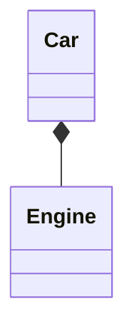

## Objects

### The Progress of Abstraction

`Assembly language` is a minimal abstraction of the underlying machine. Many so-called “imperative” languages (such as `FORTRAN`, `BASIC`, and `C`) were themselves abstractions of assembly language. Although they were big improvements, their primary abstraction still requires you to think in terms of the structure of the computer rather than the structure of the problem you are trying to solve.

`An Object has state, behavior and identity.`

These characteristics represent a pure approach to object-oriented programming: 

1. **Everything is an object.** Think of an object as a fancy variable; it stores data, but you can “make requests”, asking it to perform operations on itself. You can usually take any conceptual component in the problem you’re trying to solve (dogs, buildings, services, etc.) and represent it as an object in your program. 
2. **A program is a bunch of objects telling each other what to do by sending messages.** When you “send a message” to an object, it’s a request to call a method that belongs to that object. 
3. **Each object has its own memory made up of other objects.** Put another way, you create a new kind of object by packaging existing objects. This hides the complexity of a program behind the simplicity of objects.
4. **Every object has a type.** Each object is an instance of a class, where “class” is (approximately) synonymous with “type.” The most important distinguishing characteristic of a class is “What messages can you send to it?” 
5. **All objects of a particular type can receive the same messages.** This is a loaded statement, as you will see later. Because an object of type “circle” is also an object of type “shape,” a circle is guaranteed to accept shape messages. This means you can write code that talks to shapes and automatically handles anything that fits the description of a shape. This substitutability is a foundation of GOP. 

### An Object Has an Interface

So, although what we really do in object-oriented programming is create new data types, Virtually al object-oriented programming languages use the “`class`” keyword. When you see the word “`type`” think “`class`” and vice versa.

### Objects Provider Services

`High cohesion` is a fundamental quality of software design: It means the various aspects of a software component (such as an object, although this could also apply to a method or a library of objects) “fit together” well.

### The Hidden Implementation

Break up the playing field into class creators (those who create new data types) and client programmers (the class consumers who use the data types in their applications).

### Reusing the Implementation

The simplest way to reuse a class is to use an object of that class directly, but you can also place an object of that class inside a new class. Your new class can be made up of any number and type of other objects, in any combination, to produce the desired functionality. Because you `compose` a new class from existing classes, this concept is called **`composition`** (if composition is dynamic, it’s usually called **`aggregation`**). Composition is often called a `has-a relationship`, as in “A car has an engine.”

`Composition` comes with a great deal of flexibility. The member objects of your new class are typically private, making them inaccessible to client programmers who use the class. This means changing those members doesn’t disturb existing client code.

### Inheritance

### Is-a vs. Is-Like-a Relationship

### Interchangeable Objects with Polymorphism

The function call generated by a non-OOP compiler produces what is called `early binding`, a term you might not have heard because you’ve never thought about it any other way. It means the compiler generates a call to a specific function name, which resolves to the absolute address of the code to be executed. With inheritance, the program cannot determine the address of the code until run time, so some other scheme is necessary when a message is sent to an object.

To solve the problem, object-oriented languages use the concept of `late binding`. When you send a message to an object, the code called isn’t determined until run time. The compiler does ensure that the method exists and performs type checking on the arguments and return value, but it doesn’t know the exact code to execute.

We call this process of treating a derived type as though it were its base type `upcasting`.

### The Singly-Rooted Hierarchy

An OOP issue that has become especially prominent since the introduction of C++ is whether al classes should by default be inherited from a single base class. In Java (as with virtually all other OOP languages except for C++) the answer is yes, and the name of this ultimate base class is simply Object.

### Collections

### Parameterized Types (Generics)

Instead, you cast down the hierarchy to a more specific type, so this manner of casting is called `downcasting`. With `upcasting`, you know that a Circle is a type of Shape so it’s safe to `upcast`, but you don’t know that an Object is necessarily a Circle or a Shape so it’s not safe to `downcast` unless you determine extra type information about that object.

### Object Creation & Lifetime

### Exception Handling: Dealing with Errors

